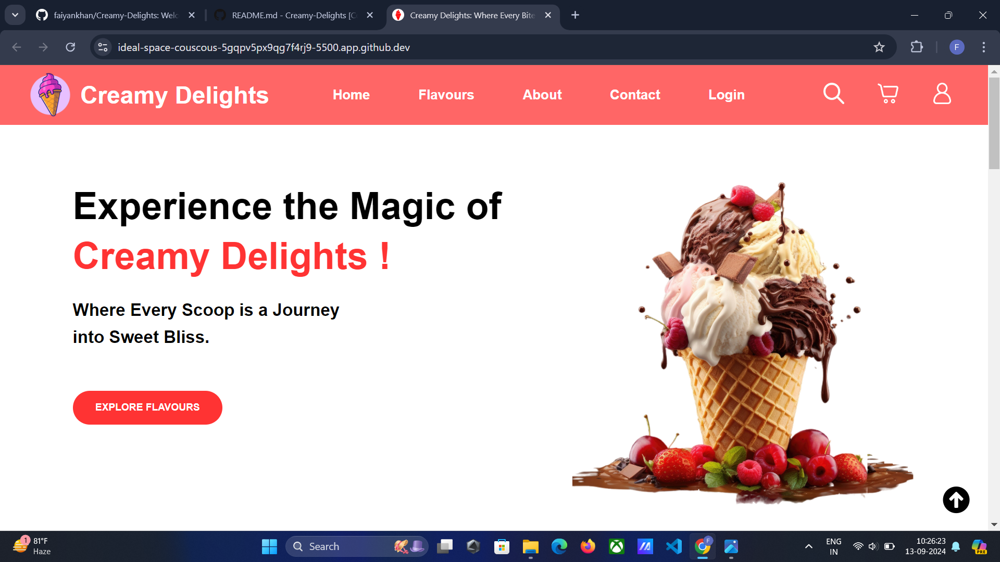

# Creamy Delights : Where Every Bite is a Delight! ❤️

Welcome to Creamy Delights, an online platform crafted especially for ice cream lovers! Our website is designed to create a smooth, enjoyable, and visually delightful experience for every user. 

## Home Page Preview:

 

The Creamy Delights website is designed to showcase a wide selection of ice cream flavors, allow customers to order online, and provide feedback for further improvements.With a user-friendly interface and vibrant imagery, visitors can easily browse through our irresistible flavors, each made from the finest ingredients. Whether you're craving classic favorites like vanilla and chocolate, or want to discover new and exciting creations, our platform makes it effortless to explore the full range of our delectable ice creams.
  

## The website offers:

- A visually appealing home page with a hero section and ice cream flavor cards.

- A feedback form for users to submit suggestions and comments.

- A responsive design that adjusts seamlessly across mobile, tablet, and desktop devices.

## Features:
- Responsive Navigation Bar: Easy navigation between different sections of the website (Home, Flavours, About, Contact, Login).

- Interactive Hero Section: Beautiful imagery and call-to-action buttons to explore ice cream flavors.

- Flavors Display: Cards showcasing various ice cream flavors with pricing and order buttons.

- Feedback Form: Users can provide feedback on their experience.

- Footer Section: Stay connected through contact info, social media links, and a newsletter sign-up form.

## Technologies Used:

- HTML5: For building the structure of the website.

- CSS3: For styling the elements and ensuring responsiveness with media queries.
